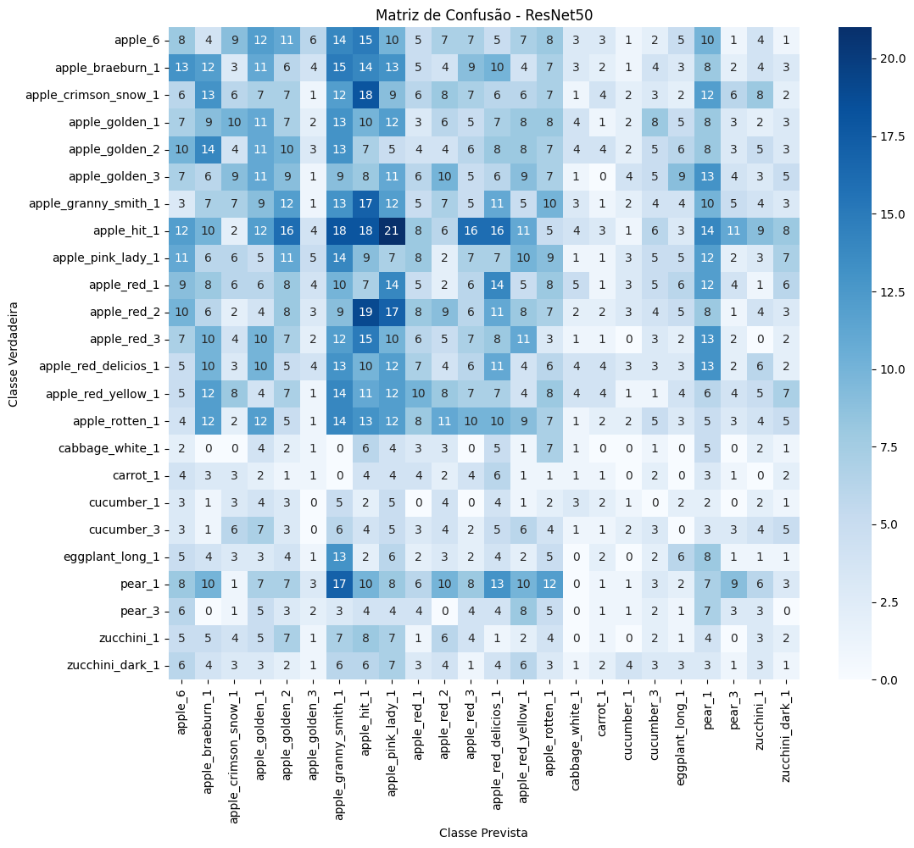

# Python Deep Learn (TensorFlow)

> My Project for class of deep learn using ternsorflow for fruit classification.

> The model is saved in the saved_models folder compressed with weights.zip

## Concepts

- Deeplearn
- TensorFlow
- Kaggle

## Training 1 (ResNet50)

Network: ResNet50

### Results train

 

#### Loss and acuracy metrics

#### Confusion Matrix metric
 

## Training 2 (MobileNetV2)

Network: MobileNetV2

### Results train

 

#### Loss and acuracy metrics
 

#### Confusion Matrix metric
 

### Create by
© [Giovane Santos](https://giovanesantossilva.github.io), © [Iara Leodoro](https://github.com/yara-leodoro)
